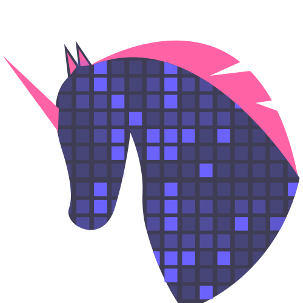

<div align="center">
    
    <h1>
Github Unicorn
</h1>
</div>

<p align="center">
   <a>
    
  </a>

  

  <a href="https://www.linkedin.com/in/walyssonpaiva/">
    
  </a>

  <a>
    
  </a>

  
</p>

<h1>
  :clipboard: Project:
</h1>
<p>Customize your github calendar graph, activity overview, progress bars and more.</p>


<h1>:unicorn: Extension:</h1>
<p>A beautiful interface to select your favorite theme:</p>


<h2>:book: Available themes:</h2>
<details>
	<summary>Take a look at all available themes:</summary>
	<ul>
		<li> Aura Mono </li>
		<li> Dark Blue </li>
		<li> Dark Unicorn </li>
		<li> Desert </li>
		<li> Github Halloween </li>
		<li> Harouin </li>
		<li> Light Blue </li>
		<li> Nord Frost </li>
		<li> Pink </li>
		<li> Sunset </li>
		<li> Unicorn </li>
	</ul>
</details>

<h2>:information_source: How to use?</h2>
<p> For now, the extension is not available on the Chrome Web Store. </p>

In your terminal:
```
Clone this repository:

$ git clone https://github.com/github-unicorn/github-unicorn
```
In your browser:
```
go to: chrome://extensions

- check the box for developer mode in the top right;
- click the load unpacked button;
- select the extension folder;
```

<h2>:bulb: How to contribute?</h2>

If you want to contribute, check [ our contribution guideline](CONTRIBUTING.md).

<div align="center">
<p>Made with :heart: by <a href="https://github.com/WalyssonPaiva">Walysson Paiva</a></p>
</div>
